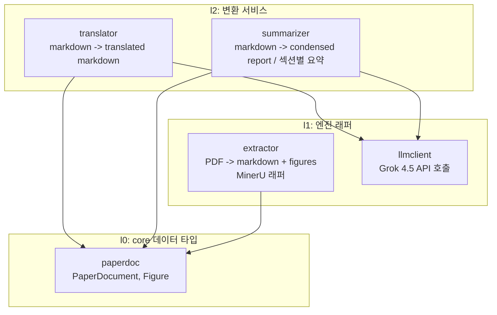
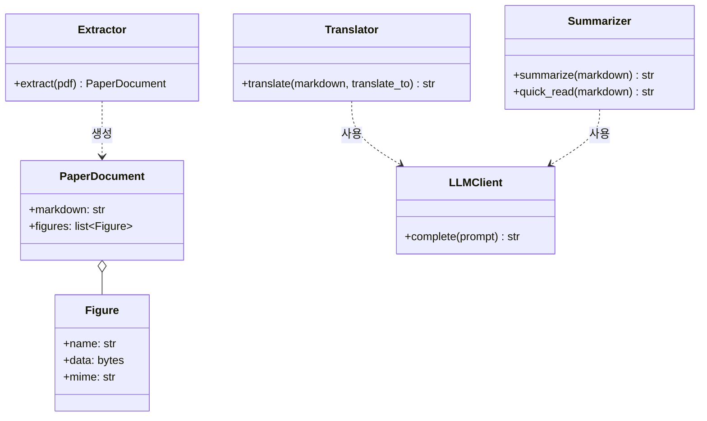
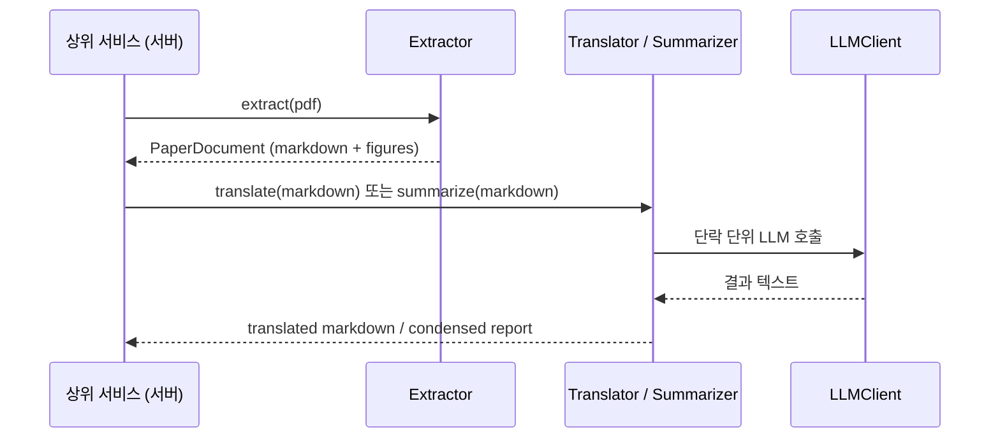

# ff-papercut 설계

## 개요

외부 논문(PDF)을 처리하는 데이터 변환 파이프라인 패키지.

[확정] Python 라이브러리 API로 제공. 상위 대형 프로젝트의 서버측 서비스(사이트에서 PDF 업로드 -> 번역/요약 제공)에서 import하여 사용한다.

[확정] 파일 저장/관리는 책임 범위 밖. 입력을 받아 출력 데이터를 반환하는 순수 변환까지만 책임진다.

## 제공하는 변환

| 변환 | 입력 | 출력 | 엔진 |
|---|---|---|---|
| 추출 | PDF | markdown data + figures | MinerU [확정] |
| 번역 | markdown data | translated markdown data | Grok 4.5 API [확정] |
| 요약 | markdown data | condensed report (TLDR + 구조화 요약) | Grok 4.5 API [확정] |
| 빨리읽기 | markdown data | 섹션별 요약 markdown | Grok 4.5 API [확정] |

## 방향성

- 세 변환은 서로 독립적으로 호출 가능하다. 상위 서비스가 요청에 따라 필요한 변환만 조합한다.
- 추출 결과(figure 포함)는 디스크 경로가 아닌 메모리 상 데이터로 반환한다. MinerU가 내부적으로 파일을 생성하더라도 래퍼가 임시 영역에서 처리 후 데이터로 회수한다. [추측]
- 번역/요약은 논문 길이가 LLM 출력 한도를 넘을 수 있으므로 단락(섹션) 단위 분할 처리를 전제로 설계한다. [추측]
- LLM 호출부는 별도 모듈로 분리하여 번역/요약이 공유한다. xAI API는 OpenAI 호환 형식이다. [근거, .meta/260709-그록4.5가격조사.md]

## 번역 규칙

- [확정] 대상 언어는 호출 시 파라미터로 받는다 (예: translate_to='한국어'). 패키지가 임의로 정하지 않는다.
- [확정] 고유명사(물질명, 학술용어 등)는 번역어 뒤에 원어를 병기한다. 예: olivine -> 감람석(olivine)
- [확정] 원어가 영어가 아닌 단어는 발음도 함께 병기한다. 예: 휘문석(Narcoanalysis;날코아날리시스)
- 그림 캡션은 markdown 본문의 일부로 함께 번역하고, 이미지 참조는 그대로 보존한다.

## 계층 구조 (Ln)

## 모듈 클래스 개요

## 사용 흐름

## 요약 형식

- [확정] 요약은 두 모드를 지원한다.
- condensed report: 논문 전체를 한 번에 요약. 상단 TLDR 1~2문장 + 구조화 요약(연구 질문/목적, 방법, 핵심 결과, 한계, 의의) 고정 markdown 템플릿. 분량은 논문 길이와 무관하게 일정.
- 섹션별 요약 (빨리읽기): 원문 섹션 순서를 따라 각 섹션을 압축. 원문 구조 보존, "원문 대신 읽는" 용도. 섹션 단위 LLM 호출로 생성.

## 미결정 사항

- [확정] 서버 GPU는 RTX 3080. pipeline 백엔드(최소 4GB)는 여유 충분, vlm 백엔드(최소 8GB)는 구동 가능하나 빠듯. [근거, .meta/260709-미네루요구사양조사.md]
- [추적필요] MinerU 백엔드 선택(pipeline vs vlm 품질 비교), 콜드 스타트/처리 시간 실측. 구현 후 확인.
- [추적필요] xAI 직접 API의 정확한 모델 ID와 최대 출력 토큰. [근거, .meta/260709-그록4.5가격조사.md]
