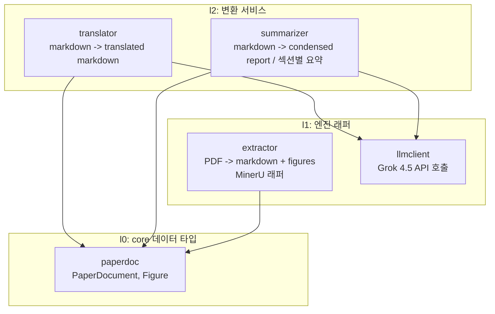
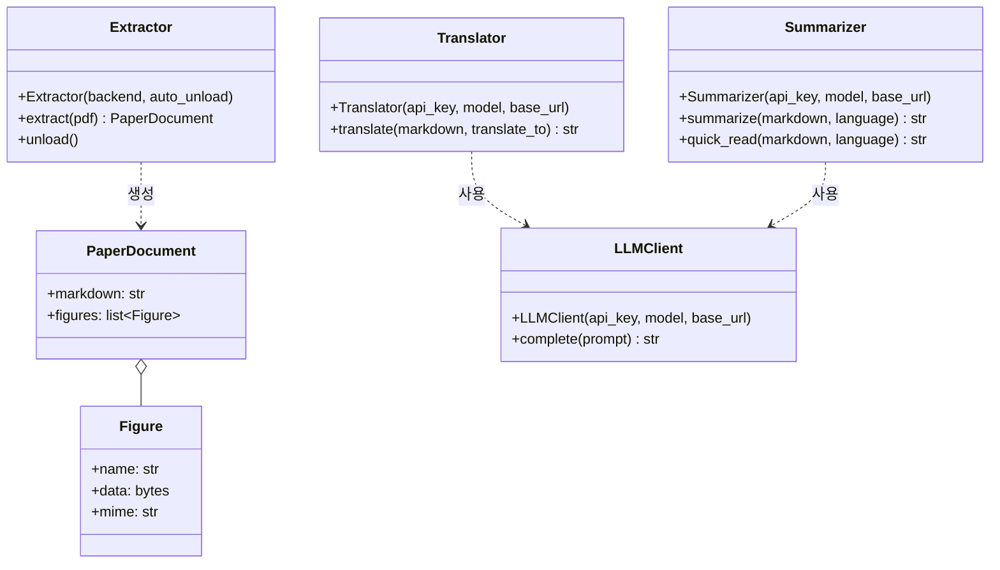
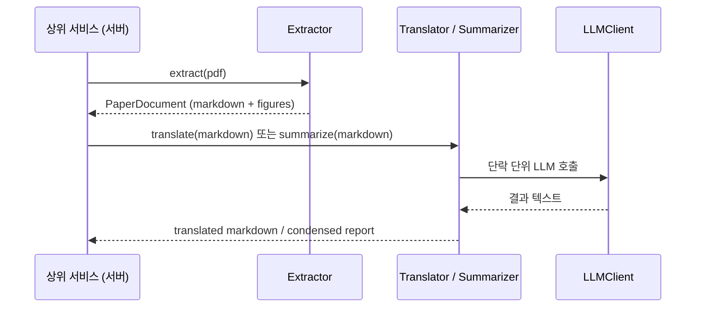

# ff-papercut 설계

## 개요

외부 논문(PDF)을 처리하는 데이터 변환 파이프라인 패키지.

[확정] Python 라이브러리 API로 제공. 상위 대형 프로젝트의 서버측 서비스(사이트에서 PDF 업로드 -> 번역/요약 제공)에서 import하여 사용한다.

[확정] 파일 저장/관리는 책임 범위 밖. 입력을 받아 출력 데이터를 반환하는 순수 변환까지만 책임진다.

## 제공하는 변환

| 변환 | 입력 | 출력 | 엔진 |
|---|---|---|---|
| 추출 | PDF | markdown data + figures | MinerU [확정] |
| 번역 | markdown data | translated markdown data | Grok 4.5 API [확정] |
| 요약 | markdown data | condensed report (TLDR + 구조화 요약) | Grok 4.5 API [확정] |
| 빨리읽기 | markdown data | 섹션별 요약 markdown | Grok 4.5 API [확정] |

## 방향성

- 세 변환은 서로 독립적으로 호출 가능하다. 상위 서비스가 요청에 따라 필요한 변환만 조합한다.
- 추출 결과(figure 포함)는 디스크 경로가 아닌 메모리 상 데이터로 반환한다. MinerU가 내부적으로 파일을 생성하더라도 래퍼가 임시 영역에서 처리 후 데이터로 회수한다. [추측]
- 번역/요약은 논문 길이가 LLM 출력 한도를 넘을 수 있으므로 단락(섹션) 단위 분할 처리를 전제로 설계한다. [추측]
- LLM 호출부는 별도 모듈로 분리하여 번역/요약이 공유한다. xAI API는 OpenAI 호환 형식이다. [근거, .meta/260709-그록4.5가격조사.md]
- [확정] 패키지는 .env 등 환경설정 파일을 직접 읽지 않는다. API 키는 객체 생성 시 파라미터로 주입받는다. 키 관리는 상위 서비스의 책임.
- [확정] API는 동기(blocking) 형태로 제공한다. async 서버는 스레드풀로 감싸 사용한다.
- [확정] LLM 사용 클래스의 생성자는 api_key 외에 model, base_url을 받는다. 기본값은 Grok 4.5 / xAI 엔드포인트. OpenAI 호환 API면 어느 업체든 교체 가능하다.
- [확정] 배포 환경: Windows 11 호스트 + Docker(WSL2). 컨테이너 내부는 Linux이므로 MinerU 백엔드 제약 없음. GPU는 WSL2 passthrough로 노출.
- [추측] extract() 입력은 bytes와 파일 경로 둘 다 허용한다.
- [추측] Extractor backend 기본값은 pipeline.
- [추측] 긴 논문 분할은 markdown 헤더(섹션) 우선, 과대 섹션은 토큰 수 기준 보조 분할.
- [추측] LLM API 오류 시 횟수 제한 재시도 후 예외를 상위로 전파한다. 패키지가 오류를 삼키지 않는다.

## 엔트리포인트

- [확정] 패키지 루트에서 Extractor, Translator, Summarizer 세 클래스를 노출한다. 상위 서비스가 필요한 것만 생성하여 조합한다.
- 근거: Extractor(GPU 모델 상주, 서버 기동 시 1회 생성)와 Translator/Summarizer(가벼운 API 호출 객체)의 자원 성격과 수명주기가 달라 분리 관리가 유리하다.
- Ln 프로토콜의 "최상위 파사드만 노출" 원칙의 예외로, 파사드 없이 기능별 클래스를 직접 노출한다.
- [확정] Extractor 생성자는 가중치의 디스크 존재를 확인하고 없으면 다운로드한다 (디스크 준비까지만). 다운로드 구간은 클래스 수준 락으로 직렬화하여 다중 객체 동시 생성 시 중복 다운로드를 방지한다.
- [확정] VRAM 로드는 lazy(첫 extract 호출 시)로 하고, unload() 메서드로 VRAM/RAM 반납 수단을 제공한다. 디스크 가중치는 unload와 무관하게 유지된다.
- unload() 후에도 객체는 유효하다. 이후 extract() 호출 시 lazy 로드가 다시 작동하여 정상 동작한다 (로딩 비용 재발생).
- [확정] Extractor 하나는 직렬로 동작한다. 내부 작업 큐가 동시 extract() 호출을 순서대로 처리한다.
- [확정] 병렬화는 Extractor 객체를 여러 개 생성하여 달성한다. 객체 수만큼 모델 인스턴스가 올라가 VRAM 점유가 비례 증가하며, 객체 간 작업 분배는 상위 서비스의 책임이다.
- [확정] 큐 소진 시 자동 unload하는 옵션(auto_unload)을 제공한다. 상주를 원하면 끄고 수동 unload()를 사용한다.
- [확정] unload 안전 규칙: 실제 반납은 진행 중 작업이 없고 큐가 비어있을 때만 수행한다. 진행 중 작업이 있으면 예약 후 완료 시점에 수행한다. 로드/상주/반납 상태 전이는 락으로 직렬화하여 unload 중 새 요청 도착 레이스를 방지한다.
- [확정] 다중 객체 간 책임 경계: 객체끼리 공유 상태가 없어 논리적 레이스는 없다. VRAM 예산(객체 수 결정)은 상위 서비스 책임, 모델 캐시 디렉토리 동시 접근 안전성은 패키지 책임이다.

## 번역 규칙

- [확정] 대상 언어는 호출 시 파라미터로 받는다 (예: translate_to='한국어'). 패키지가 임의로 정하지 않는다.
- [확정] 고유명사(물질명, 학술용어 등)는 번역어 뒤에 원어를 병기한다. 예: olivine -> 감람석(olivine)
- [확정] 원어가 영어가 아닌 단어는 발음도 함께 병기한다. 예: 휘문석(Narcoanalysis;날코아날리시스)
- 그림 캡션은 markdown 본문의 일부로 함께 번역하고, 이미지 참조는 그대로 보존한다.

## 계층 구조 (Ln)

## 모듈 클래스 개요

## 사용 흐름

## 요약 형식

- [확정] 요약은 두 모드를 지원한다.
- [확정] 요약 결과의 언어는 language 파라미터로 지정한다. 번역 규칙(원어 병기 등)을 동일하게 적용한다.
- condensed report: 논문 전체를 한 번에 요약. 상단 TLDR 1~2문장 + 구조화 요약(연구 질문/목적, 방법, 핵심 결과, 한계, 의의) 고정 markdown 템플릿. 분량은 논문 길이와 무관하게 일정.
- 섹션별 요약 (빨리읽기): 원문 섹션 순서를 따라 각 섹션을 압축. 원문 구조 보존, "원문 대신 읽는" 용도. 섹션 단위 LLM 호출로 생성.

## 미결정 사항

- [확정] 서버 GPU는 RTX 3080. pipeline 백엔드(최소 4GB)는 여유 충분, vlm 백엔드(최소 8GB)는 구동 가능하나 빠듯. [근거, .meta/260709-미네루요구사양조사.md]
- [추적필요] MinerU 백엔드 선택(pipeline vs vlm 품질 비교), 콜드 스타트/처리 시간 실측. 구현 후 확인.
- 다중 객체 동시 최초 다운로드는 생성자의 클래스 수준 락으로 해결 (동일 프로세스 내). 멀티프로세스로 객체를 만드는 환경에서는 배포 단계에서 mineru-models-download로 사전 다운로드를 권장.
- [추적필요] xAI 직접 API의 정확한 모델 ID와 최대 출력 토큰. [근거, .meta/260709-그록4.5가격조사.md]
